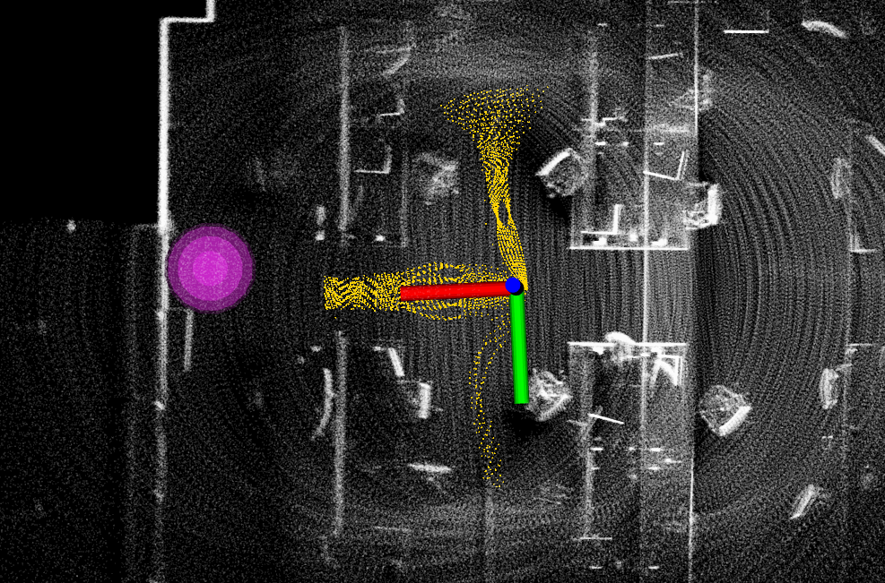
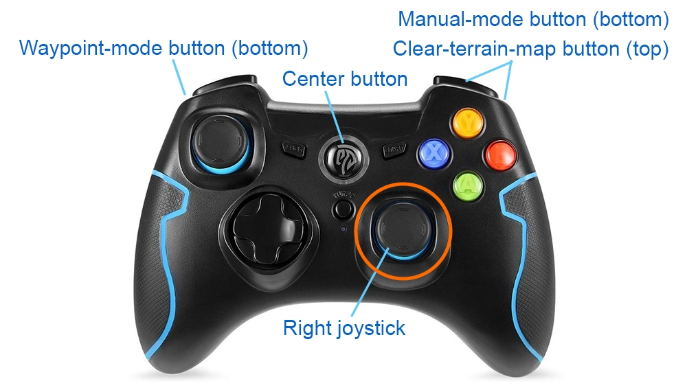
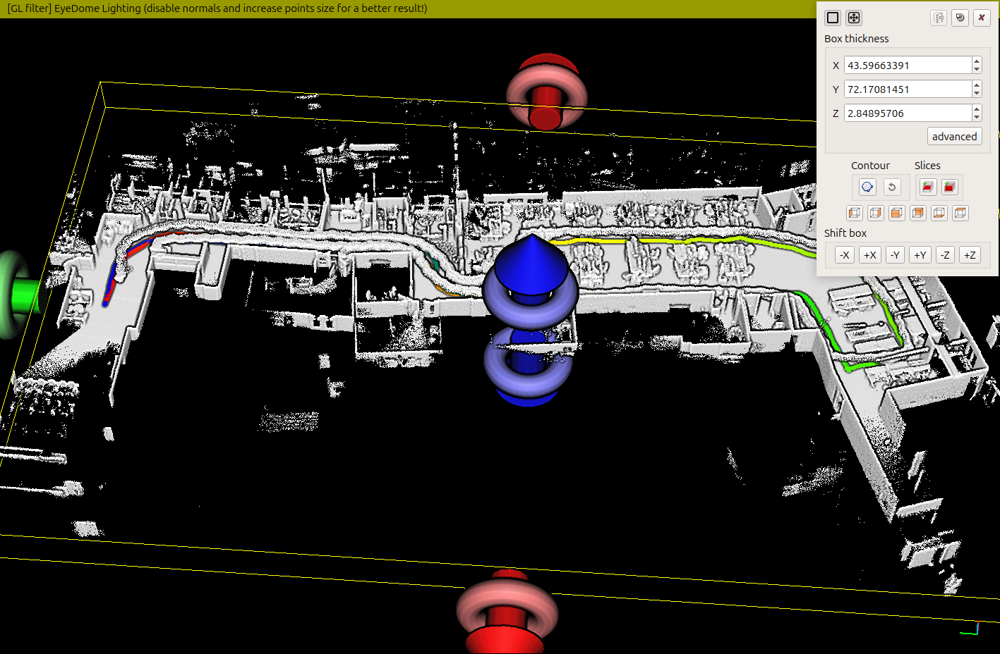

Collision Avoidance
-------------------

The collision avoidance planner warrants safety in reaching waypoints that are sent by high-level planners. It computes and follows collision-free paths that lead to the waypoint. The collision avoidance planner pre-computes a motion primitive library and associates the motion primitives to 2D locations in the vicinity of the vehicle. The motion primitives are modeled as Monte Carlo samples and organized in groups. In real-time, when a location is occupied by obstacles, the planner can determine motion primitives that collide with the obstacle within milliseconds. The planner then selects the group of motion primitives with the maximum likelihood toward the waypoint. The traversability is determined by the terrain characteristics. The collision avoidance planner takes in the terrain map from the terrain traversability analysis module (see Terrain Traversability Analysis section).

Launch the system in base mode and use the ‘Waypoint’ button in RVIZ to set a waypoint in the vicinity of the vehicle. Make sure the waypoint is reachable. Users should see yellow collision-free paths in RVIZ while the vehicle approaches the waypoint.

    The yellow paths are collision-free paths and the magenta ball is the waypoint.

Alternatively, the collision avoidance planner can take joystick input. This is equivalent to setting a waypoint very far and only the direction to the waypoint is effective. Users can use the physical joystick controller or the virtual joystick in RVIZ to navigate the vehicle. The vehicle will avoid collisions. If using the physical joystick controller, operate the right joystick on it. To resume navigation to the waypoint, click the 'Resume Navigation to Goal' button in RVIZ. Or, users can hold the 'waypoint-mode' button on the controller and use the right joystick to set the speed.

+---------------------------------+---------------------------------+
|| .. figure:: images/image15.png || .. figure:: images/image22.png |
||     :height: 200px             ||     :height: 200px             |
||                                ||                                |
||     Caption for image 1        ||     Caption for image 2        |
+---------------------------------+---------------------------------+

|pic1| any text |pic2|

