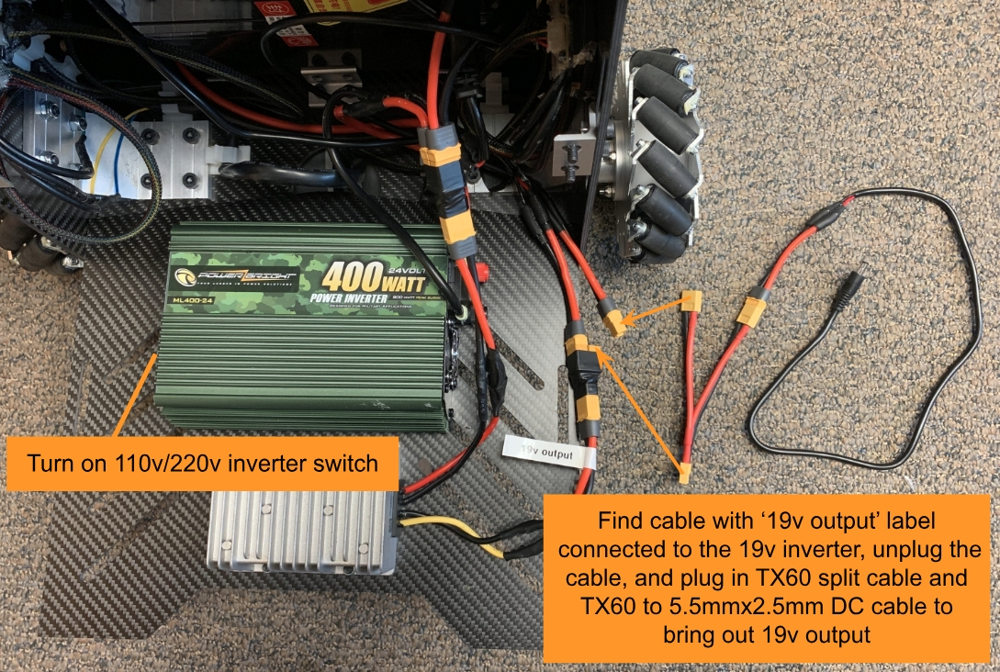

Extentions
==========

The vehicle hardware is designed to support advanced AI in mind. Space and power options are provided for users to install a Jetson AGX Orin computer or a gaming laptop. Mounting slots and holes are available on the top board for users to install additional sensors and equipment. If adding components on the top board in the lidar FOV, please change 'blindFront', 'blindBack', 'blindLeft', and 'blindRight' in the `'autonomy_stack_mecanum_wheel_platform/src/slam/arise_slam_mid360/config/livox_mid360.yaml' <https://github.com/jizhang-cmu/autonomy_stack_mecanum_wheel_platform/blob/jazzy/src/slam/arise_slam_mid360/config/livox_mid360.yaml>`_ file accordingly to exclude the components from the lidar sensing.

The vehicle has a 19v inverter and a 110v/220v inverter, both at 400+W rating to power the equipment. Open the front panel on the vehicle. If using the 19v inverter, find the cable with the ‘19v output’ label connected to the 19v inverter, unplug the cable, and plug in the TX60 split cable and the TX60 to 5.5mmx2.5mm DC cable to bring out the 19v output. To use the 110v/220v inverter, turn on the inverter switch. Users can plug in the add-on AI computer power supply to the 110v/220v inverter and keep it inside the vehicle chassis.

If adding a Jetson AGX Orin computer, open the front and back panels on the vehicle. Users can install it upside-down using the designated mounting holes on the top board. If adding a gaming laptop, users can fasten it on the top board with the bungee cords (figure). Then, connect the add-on AI computer to the vehicle NUC computer via the USB to Ethernet adapter (on the vehicle NUC computer side) and the Ethernet cable. Configure both computers to use manual IPs, e.g. vehicle NUC computer at 10.1.1.100 and add-on computer at 10.1.1.101. Please avoid the 192.168.1.x subnet as being used by the Mid-360 lidar. With the vehicle system running on the vehicle NUC computer, users should be able to list all the topics on the add-on AI computer using ‘ros2 topic list’ in a terminal. Further, to use the add-on AI computer with remote desktop software, e.g. NoMachine, AnyDesk, or TeamViewer, plug in the dummy HDMI plug to the add-on AI computer to enable the computer display. For ROS message sharing between the vehicle NUC computer and the add-on AI computer via an Ethernet cable, refer to the `ROS Message Sharing across Computers <https://tarerobotics.readthedocs.io/en/latest/other_useful_information/ros_message_sharing_across_computers.html>`_ section. 

Alternatively, users can set up the autonomy stack on the add-on AI computer. Follow instructions in the `Ubuntu System Setup <https://tarerobotics.readthedocs.io/en/latest/other_useful_information/ubuntu_system_setup.html>`_ section. Then, unplug all the HDMI/Ethernet/USB cables as well as the joystick controller dongle from the vehicle NUC computer and plug them into the add-on AI computer. Now, users can launch the entire system on the add-on AI computer.

Adding Camera
-------------

Users can add custom cameras to the vehicle. To assist this, we released `an open-source repository <https://github.com/jizhang-cmu/360_camera>`_ to use the Ricoh Theta Z1 camera as an example. In addition to the camera driver, manual extrinsic and latency calibration code is provided in the repository. When mounting the camera, we recommend placing the camera on a boom behind the lidar to reduce lidar FOV blockage. Potential applications of adding cameras to the vehicle include running a semantic segmentation model for people and scene understanding and a vision-language model for human-robot interactions as well as autonomous navigation guidance.

.. image:: ./images/image32.png
    :width: 25%

Adding Manipulation Arm
-----------------------

Users can add a manipulation arm to the vehicle. We recommend selecting arms no more than 5kg. With an arm installed, when the vehicle approaches an object and tries to grasp the object, users may need to locally re-position the vehicle for the ease of grasping the object. For this purpose, please try `this open-source ROS package <https://github.com/jizhang-cmu/gadgets/tree/jazzy/local_movement>`_ to move the vehicle around in short and direct movements.

.. image:: ./images/image33.png
    :width: 33%

The mounting hole pattern on the vehicle top board is provided. This can help users design an adapter plate to mount the manipulation arm.

Multi-robot Coordination
------------------------

A multi-robot coordination system may need to involve `a wireless ad hoc network <https://en.wikipedia.org/wiki/Wireless_ad_hoc_network>`_ for inter-vehicle communication, where each vehicle needs to be installed with a radio node that connects to the network. Compared to a traditional centralized network, a wireless ad hoc network does not require a central router or wireless access point, which allows vehicles to establish a direct point-to-point connection when they are within the wireless communication range. The vehicles can utilize the ad hoc network for data sharing and coordination during autonomous navigation.

.. image:: ./images/image34.png
    :width: 55%

