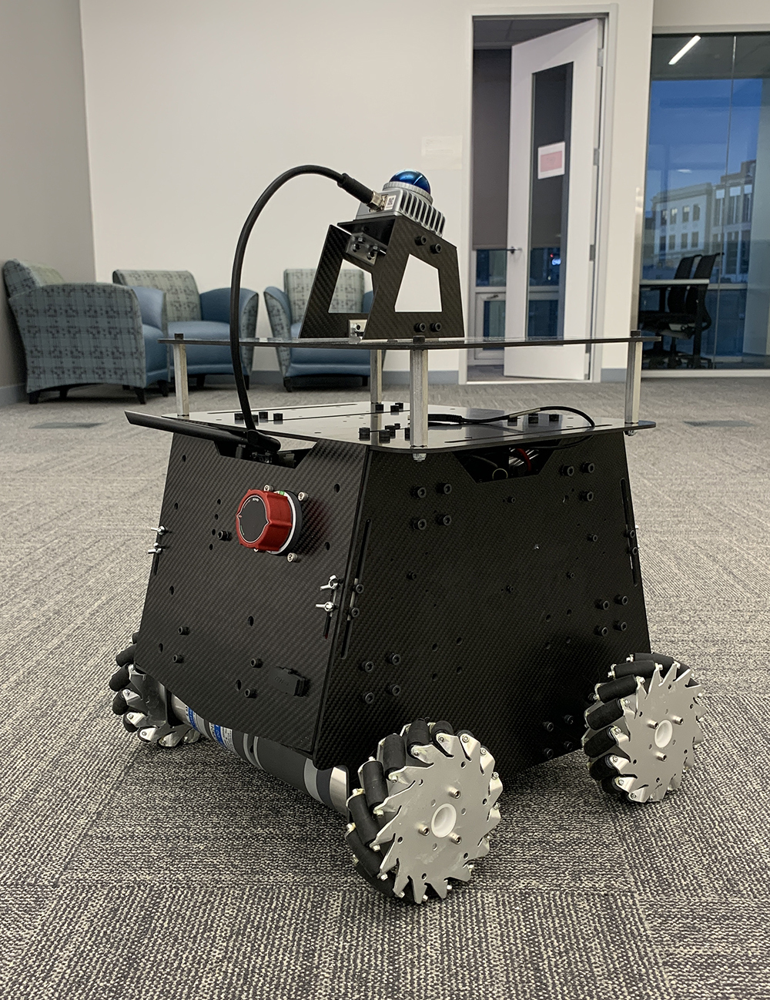
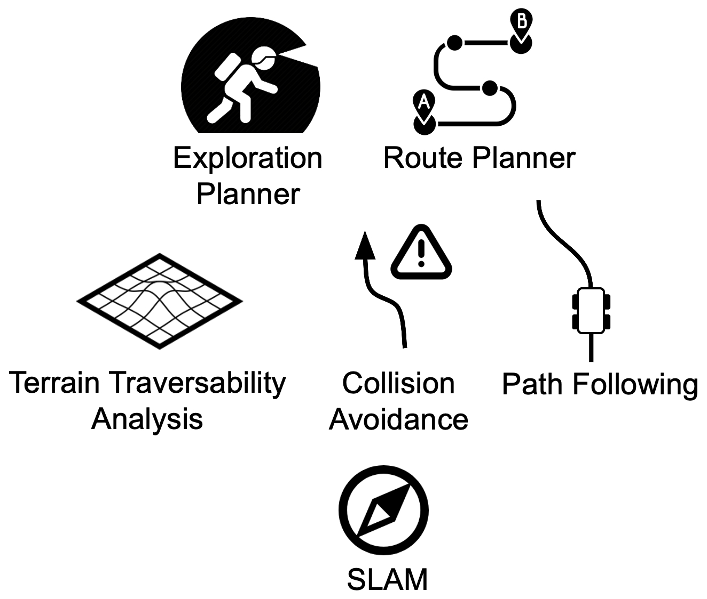

.. toctree::

Introduction
------------

T-Bot is a versatile education and research platform equipped with a `Livox Mid360 lidar <https://www.livoxtech.com/mid-360>`_ and Mecanum wheels. Additional sensors and equipment can be mounted to the top board with various mounting options. The platform comes with an Intel NUC i7 computer for running our full autonomy stack. Space and power options are provided for an additional Nvidia Jetson AGX Orin computer and a gaming laptop to run GPU applications. We provide a simulation setup together with the real robot setup for users to take advantage of the system in various use cases. `The full autonomy stack is open-sourced <https://github.com/jizhang-cmu/autonomy_stack_mecanum_wheel_platform>`_ with commercial-free license. In addition to serving for education and research purposes, users are welcome to use our platform as a starting point for proof-of-concept product development. In the next stage, users can migrate the open-source autonomy stack to custom platforms for commercial applications.

The autonomy stack shares a three-tier system architecture, containing a SLAM module, a route planner, an exploration planner, and a base autonomy system, where the base autonomy system includes fundamental navigation modules for terrain traversability analysts, collision avoidance, and waypoint following. The system overall is capable of taking a goal point and navigating the vehicle autonomously to the goal point as well as exploring an environment and building a map along the way. Alternatively, the system allows users to use a joystick controller to guide the navigation while the system itself is in charge of collision avoidance.

    
    Three-tier autonomy stack.

Please refer to the ‘Quick Start Guide’ section to get familiar with the system operations. To try our system in simulation on any computer, see the `Simulation Setup <https://github.com/jizhang-cmu/autonomy_stack_mecanum_wheel_platform?tab=readme-ov-file#simulation-setup>`_ section in the GitHub repository.

