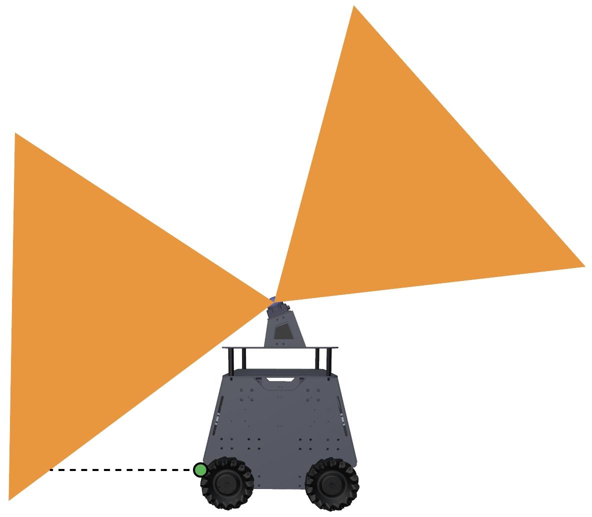

Other Useful Features
=====================

**Adding additional collision detection sensors:** The built-in Mid360 lidar leaves a blind area at the lower front of the vehicle. If users add additional collision detection sensors, such as a line sensor to compensate for the blind area (green dot in the figure), send the data as `ROS PointCloud2 <https://docs.ros2.org/foxy/api/sensor_msgs/msg/PointCloud2.html>`_ typed messages on the '/added_obstacles' topic. The data needs to be converted into world frame first using the state estimation output (`ROS Odometry <https://docs.ros2.org/foxy/api/nav_msgs/msg/Odometry.html>`_ typed messages on the '/state_estimation' topic). The system will take the points and use them together with the Mid360 lidar points for collision avoidance. Note that this is mostly for handling the extreme cases where low obstacles move quickly into the blind area in front of the vehicle.

|

**Turning on/off collision checking:** Users can send a `ROS Bool <https://docs.ros2.org/foxy/api/std_msgs/msg/Bool.html>`_ typed message on the '/check_obstacle' topic to turn on/off collision checking during navigation.

**Safety stopping:** To introduce a safety stop during navigation, send a `ROS Int8 <https://docs.ros2.org/foxy/api/std_msgs/msg/Int8.html>`_ typed message on the '/stop' topic. The value being 1 means no moving but turning in one place is allowed, and the value being 2 means no moving or turning. To release the safety stop, send 0.

**Adjusting speed:** To change the speed during navigation, send a `ROS Float32 <https://docs.ros2.org/foxy/api/std_msgs/msg/Float32.html>`_ typed message on the '/speed' topic. The value should be between 0-1 as a fraction of the maximum speed. Example code is provided in the `'src/base_autonomy/waypoint_example' <https://github.com/jizhang-cmu/autonomy_stack_mecanum_wheel_platform/tree/jazzy/src/base_autonomy/waypoint_example>`_ package.

**Sending navigation boundary:** Please refer to the example code in the `'src/base_autonomy/waypoint_example' <https://github.com/jizhang-cmu/autonomy_stack_mecanum_wheel_platform/tree/jazzy/src/base_autonomy/waypoint_example>`_ package to send navigation boundary. Note that the navigation boundary can include multiple polygons. Points on the same polygon share the same z value. Use different z values for each polygon. Further, to define a closed polygon, the last point needs to repeat the first point. For example, to define a rectangular navigation boundary, use 5 points: 'p1, p2, p3, p4, p1'.

**Resetting terrain map:** Occasionally, the terrain map is messed up due to state estimation being unstable, for example. The vehicle cannot find a path and gets stuck. To reset the terrain map, send a `ROS Float32 <https://docs.ros2.org/foxy/api/std_msgs/msg/Float32.html>`_ typed message on the '/map_clearing' topic. The value determines the range to clear on the terrain map. Alternatively, users can press the 'clear-terrain-map' button on the joystick controller.

**Recording and processing bagfiles:** To record the sensor data to a bagfile, source the ROS workspace in a terminal (due to custom format for the scan messages) and use the command lines below while the system is running.

.. code-block:: console

  $ source autonomy_stack_mecanum_wheel_platform/install/setup.bash
  $ ros2 bag record /imu/data /lidar/scan -o 'bagfolder_path'

To launch the system for bagfile processing, use of the command lines below. For base autonomy system:

.. code-block:: console

  $ cd autonomy_stack_mecanum_wheel_platform
  $ ./system_bagfile.sh

For system with route planner:

.. code-block:: console

  $ cd autonomy_stack_mecanum_wheel_platform
  $ ./system_bagfile_with_route_planner.sh

For system with exploration planner:

.. code-block:: console

  $ cd autonomy_stack_mecanum_wheel_platform
  $ ./system_bagfile_with_exploration_planner.sh

In another terminal, source the ROS workspace (required) and play the bagfile.

.. code-block:: console

  $ source autonomy_stack_mecanum_wheel_platform/install/setup.bash
  $ ros2 bag play 'bagfolder_path/bagfile_name.mcap (or bagfile_name.db3)'

`A few example bagfiles are provided here. <https://drive.google.com/drive/folders/1G1JYkccvoSlxyySuTlPfvmrWoJUO8oSs?usp=sharing>`_ Users can use the bagfiles to test the system offline without accessing the real-robot setup. For bagfile processing, please follow the `Vehicle NUC Computer Setup <https://tarerobotics.readthedocs.io/en/latest/other_useful_information/vehicle_nuc_computer_setup.html>`_ section to set up the system and autonomy stack.
