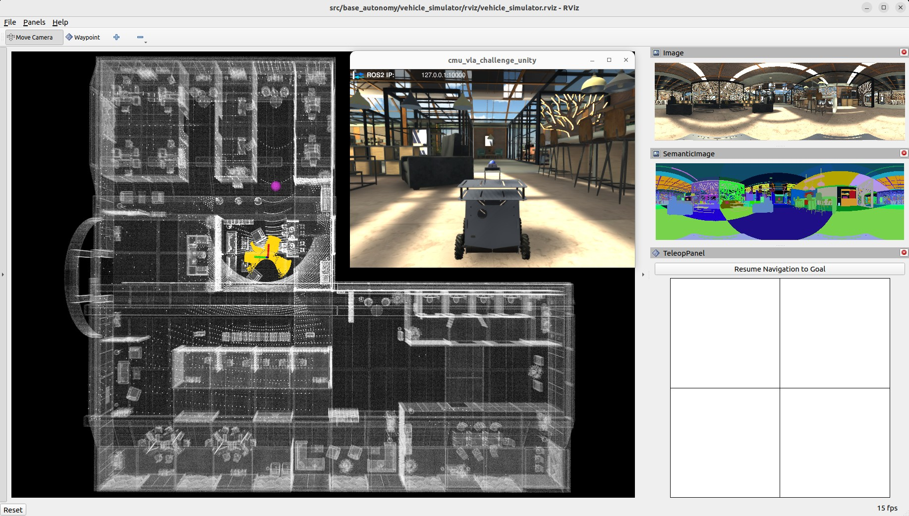
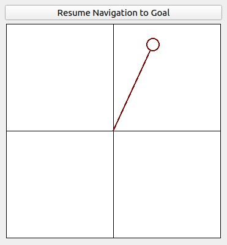
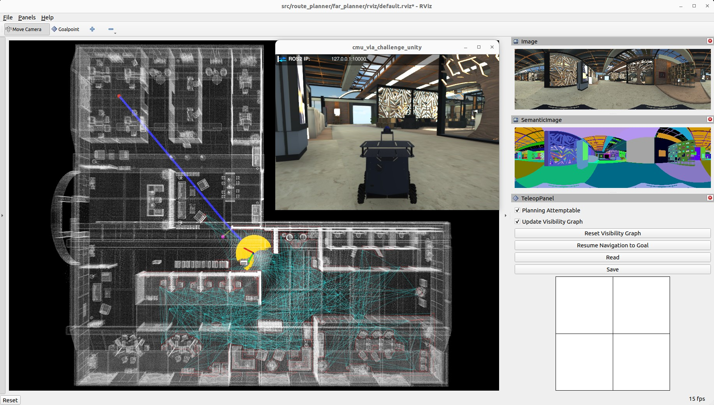
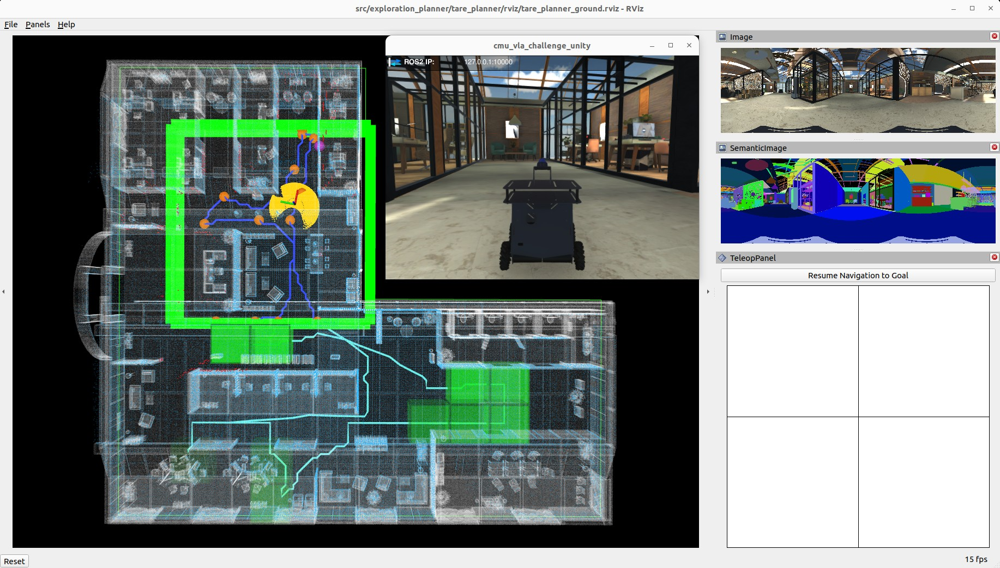

Simulation System Setup
=======================

Base Autonomy System
--------------------

This section contains instructions to set up our autonomy stack for simulation using Ubuntu 24.04 with `ROS2 Jazzy <https://docs.ros.org/en/jazzy/Installation.html>`_ (recommended distribution). For other Ubuntu and ROS2 distributions, please refer to the corresponding branches in the `GitHub repository <https://github.com/jizhang-cmu/autonomy_stack_mecanum_wheel_platform>`_. The system is integrated with `Unity <https://unity.com>`_ environment models. After installing ROS2 Jazzy, add 'source /opt/ros/jazzy/setup.bash' to the '~/.bashrc' file and ``source ~/.bashrc`` in the terminal to engage the installation.

.. code-block:: XML

    echo "source /opt/ros/jazzy/setup.bash" >> ~/.bashrc
    source ~/.bashrc

Install dependencies with the command lines below.

.. code-block:: XML

    sudo apt update
    sudo apt install ros-jazzy-desktop-full ros-jazzy-pcl-ros libpcl-dev git

Clone the open-source repository.

.. code-block:: XML

    git clone https://github.com/jizhang-cmu/autonomy_stack_mecanum_wheel_platform.git

In a terminal, go to the folder, checkout the 'jazzy' branch, and compile. Note that this skips the SLAM module and Mid-360 lidar driver. The two packages are not needed for simulation.

.. code-block:: XML

    cd autonomy_stack_mecanum_wheel_platform
    git checkout jazzy
    colcon build --symlink-install --cmake-args -DCMAKE_BUILD_TYPE=Release --packages-skip arise_slam_mid360 arise_slam_mid360_msgs livox_ros_driver2

Download `a Unity environment model <https://drive.google.com/drive/folders/1G1JYkccvoSlxyySuTlPfvmrWoJUO8oSs?usp=sharing>`_ and unzip the files to the `autonomy_stack_mecanum_wheel_platform/src/base_autonomy/vehicle_simulator/mesh/unity <https://github.com/jizhang-cmu/autonomy_stack_mecanum_wheel_platform/tree/jazzy/src/base_autonomy/vehicle_simulator/mesh/unity>`_ folder. The environment model files should look like below. For computers without a powerful GPU, please try the 'without_360_camera' version for a higher rendering rate.

.. image:: ../images/image25.png
    :width: 35%

In a terminal, go to the repository folder and launch the system.

.. code-block:: XML

   ./system_simulation.sh

After seeing data showing up in RVIZ, users can use the 'Waypoint' button to set waypoints and navigate the vehicle around. Note that the waypoints are meant to be relatively close to the vehicle. Setting the waypoint too far can cause the vehicle to get stuck at a dead end. Users can also operate in *smart joystick mode* where the vehicle tries to follow joystick commands and also avoid collisions. To do this, users can use the control panel in RVIZ or the joystick controller. When using the joystick controller, users can also operate in *manual mode* without any collision avoidance. Detailed information about the operations in the three modes is below.

- *Smart joystick mode (default)*: The vehicle tries to follow joystick commands and also avoid collisions. Use the control panel in RVIZ or the right joystick on the joystick controller to set the speed and yaw rate. If the system is in another mode, doing so will switch the system to *smart joystick mode*.

- *Waypoint mode*: The vehicle tries to follow waypoints and also avoid collisions. Use the 'Waypoint' button in RVIZ to set a waypoint by first clicking the button and then clicking where the waypoint is to be set around the vehicle. If the system is in another mode, clicking the 'Resume Navigation to Goal' button in RVIZ switches the system to *waypoint mode*. Or, users can hold the 'waypoint-mode' button on the joystick controller and use the right joystick to set the speed. If only holding the 'waypoint-mode' button, the system will use the speed sent in ROS messages.

- *Manual mode*: The vehicle tries to follow joystick commands without any collision avoidance. Pressing the 'manual-mode' button on the joystick controller switches the system to *manual mode*. Then, use the right joystick to set the forward and lateral speed and the left joystick to set the yaw rate, in the Mode 2 convention.

|pic1| |pic2|

.. |pic1| image:: ../images/image15.jpg
    :width: 55% 

Alternatively, users can run a ROS node to send a series of waypoints. In another terminal, go to the folder and source the ROS workspace, then run the ROS node with the command lines below. The ROS node sends navigation boundary and speed as well. Click the 'Resume Navigation to Goal' button in RVIZ, and the vehicle will navigate inside the boundary following the waypoints.

.. code-block:: XML

    source install/setup.sh
    ros2 launch waypoint_example waypoint_example.launch

System with Route Planner
-------------

The route planner conducts planning in the global environment and guides the vehicle to navigate to a goal point. To launch the system with route planner, use the command line below.

.. code-block:: XML

    ./system_simulation_with_route_planner.sh

Users can send a goal point with the 'Goalpoint' button in RVIZ. The vehicle will navigate to the goal and build a visibility graph (in cyan) along the way. Areas covered by the visibility graph become free space. When navigating in free space, the planner uses the built visibility graph, and when navigating in unknown space, the planner attempts to discover a way to the goal. By pressing the 'Reset Visibility Graph' button, the planner will reinitialize the visibility graph. By unchecking the 'Planning Attemptable' checkbox, the planner will first try to find a path through the free space. The path will show in green. If such a path does not exist, the planner will consider unknown space together. The path will show in blue (shown in the figure). By unchecking the 'Update Visibility Graph' checkbox, the planner will stop updating the visibility graph. Use the 'Save' buttons to save the visibility graph to file and the 'Read' button to load it.

When navigating with the route planner, the base autonomy system operates in *waypoint mode*. Users can click in the black box on the control panel to switch to *smart joystick mode*, or press the buttons on a joystick controller to switch to *smart joystick mode* or *manual mode*. To resume route planner navigation, click the 'Resume Navigation to Goal' button in RVIZ or use the 'Goalpoint' button to set a new goalpoint. Or, users can hold the 'waypoint-mode' button on the joystick controller and use the right joystick to set the speed.

System with Exploration Planner
-------------------

The exploration planner conducts planning in the global environment and guides the vehicle to cover the environment. To launch the system with exploration planner, use the command line below.

.. code-block:: XML
    ./system_simulation_with_exploration_planner.sh

Click the 'Resume Navigation to Goal' button in RVIZ to start the exploration. Users can adjust the navigation boundary to constrain the areas to explore by updating the boundary polygon in the `'autonomy_stack_mecanum_wheel_platform/src/exploration_planner/tare_planner/data/boundary.ply' <https://github.com/jizhang-cmu/autonomy_stack_mecanum_wheel_platform/blob/jazzy/src/exploration_planner/tare_planner/data/boundary.ply>`_ file. Also, set ``use_boundary = true`` in the `'autonomy_stack_mecanum_wheel_platform/src/exploration_planner/tare_planner/launch/explore_world.launch' <https://github.com/jizhang-cmu/autonomy_stack_mecanum_wheel_platform/blob/jazzy/src/exploration_planner/tare_planner/launch/explore_world.launch>`_ file to tune on exploration boundary.

When navigating with the exploration planner, the base autonomy system operates in *waypoint mode*. Users can click in the black box on the control panel to switch to smart *joystick mode*, or press the buttons on a joystick controller to switch to *smart joystick mode* or *manual mode*. To resume exploration, click the 'Resume Navigation to Goal' button in RVIZ. Or, users can hold the 'waypoint-mode' button on the joystick controller and use the right joystick to set the speed.

