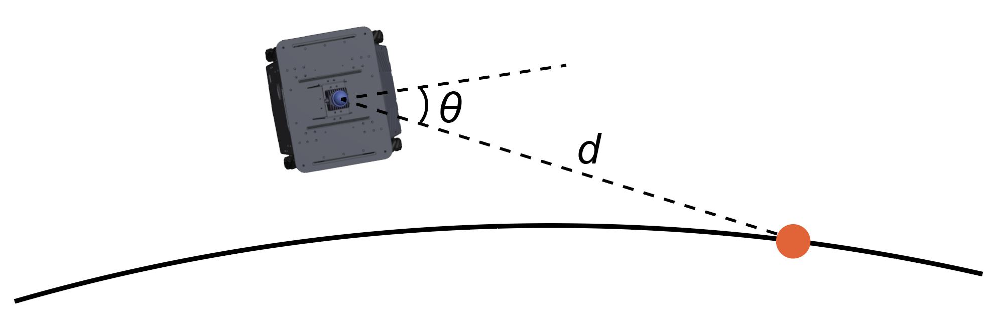

Path Following
==============

The path following module uses pure-pursuit path tracking. Given a path computed by the collision avoidance planner, it tracks the look-ahead point on the path (orange dot in the figure) at a certain distance ahead of the vehicle. Here, *d* is the look-ahead distance. During path following navigation, the vehicle adjusts its heading to keep *θ* around zero. The vehicle also adjusts its forward speed and lateral speed to move toward the look-ahead point. Due to the Mid360 lidar being pitched forward with better visibility in the front direction, we limit the forward speed to be non-negative. In our implementation, the system maintains its speed with smooth accelerations and decelerations. At turnings when \|*θ*\| exceeds a threshold, the vehicle slows down and turns in one place. When the vehicle gets close to the waypoint, it slows down as well and finally stops at the waypoint.

