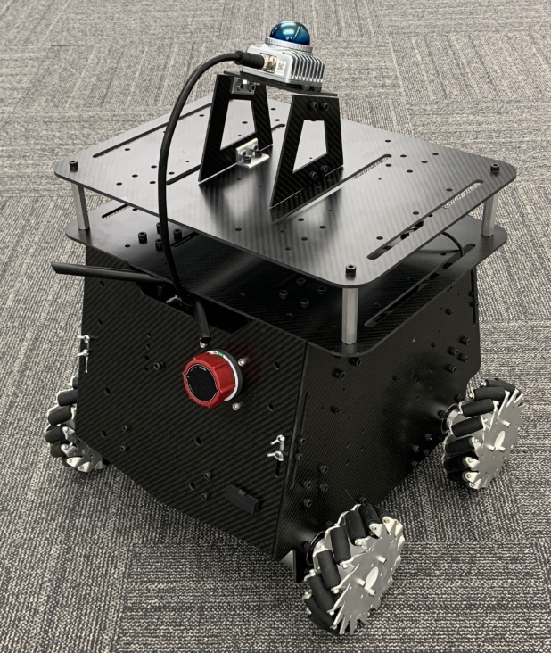
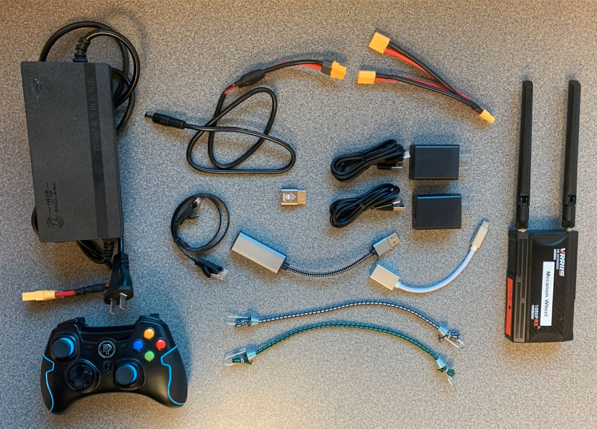
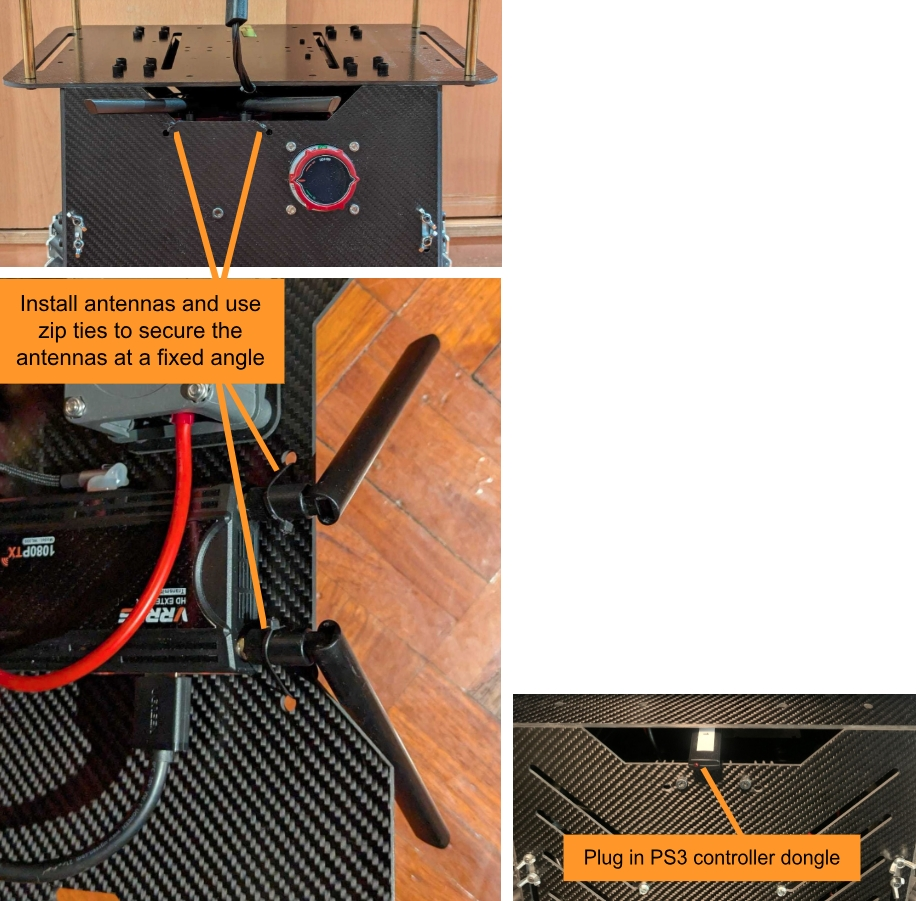
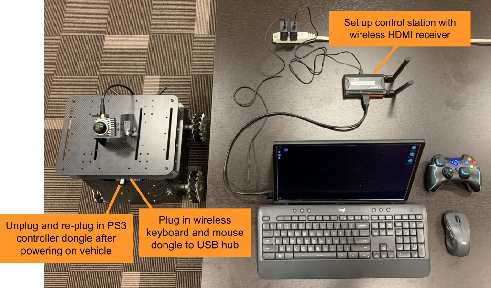
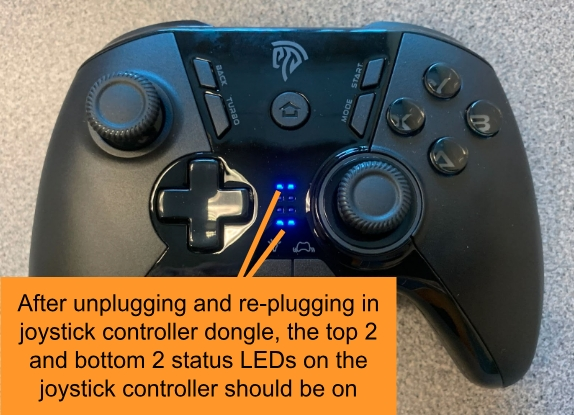

Quick Start Guide
=================

Opening Box
-----------

The box contains the Mecanum wheel vehicle, battery charger, joystick controller, wireless HDMI receiver, TX60 split cable, TX60 to 5.5mmx2.5mm DC cable, USB-A to Ethernet adapter, USB-C to USB-A adapter, Ethernet cable, 2x 5v chargers, 2x USB-C cables, dummy HDMI plug, and 2x bungee cords. **Please make sure to charge the vehicle battery fully.**

|pic1| |pic2|

Installing Antennas and Dongle
------------------------------

The antennas of the wireless HDMI sender are removed for shipping, please open the rear panel of the vehicle and install the antennas. Then, use zip ties to secure the antennas at a fixed angle. Also, plug in the joystick controller dongle to the USB hub on the vehicle. The joystick controller dongle, antennas, and zip ties are included in the box.

Setting up Control Station
--------------------------

Please prepare a monitor with HDMI cable and a set of wireless keyboard and mouse. Plug in the wireless keyboard and mouse dongle to the USB hub on the vehicle. Set up a control station by connecting the wireless HDMI receiver to the monitor with the HDMI cable and powering it on with the 5v charger and USB-C cable. Power on the vehicle by turning the switch clockwise all the way to the end and voltage is displayed on the switch. Wait for a minute and the onboard NUC i7 computer desktop should show up on the monitor.

The PS3 controller dongle may not be recognized correctly after the vehicle is powered on. **Please unplug and re-plug in the PS3 controller dongle once after powering on the vehicle for it to be recognized correctly. Once recognized correctly, the top 2 and bottom 2 status LEDs on the PS3 controller should be on.**

