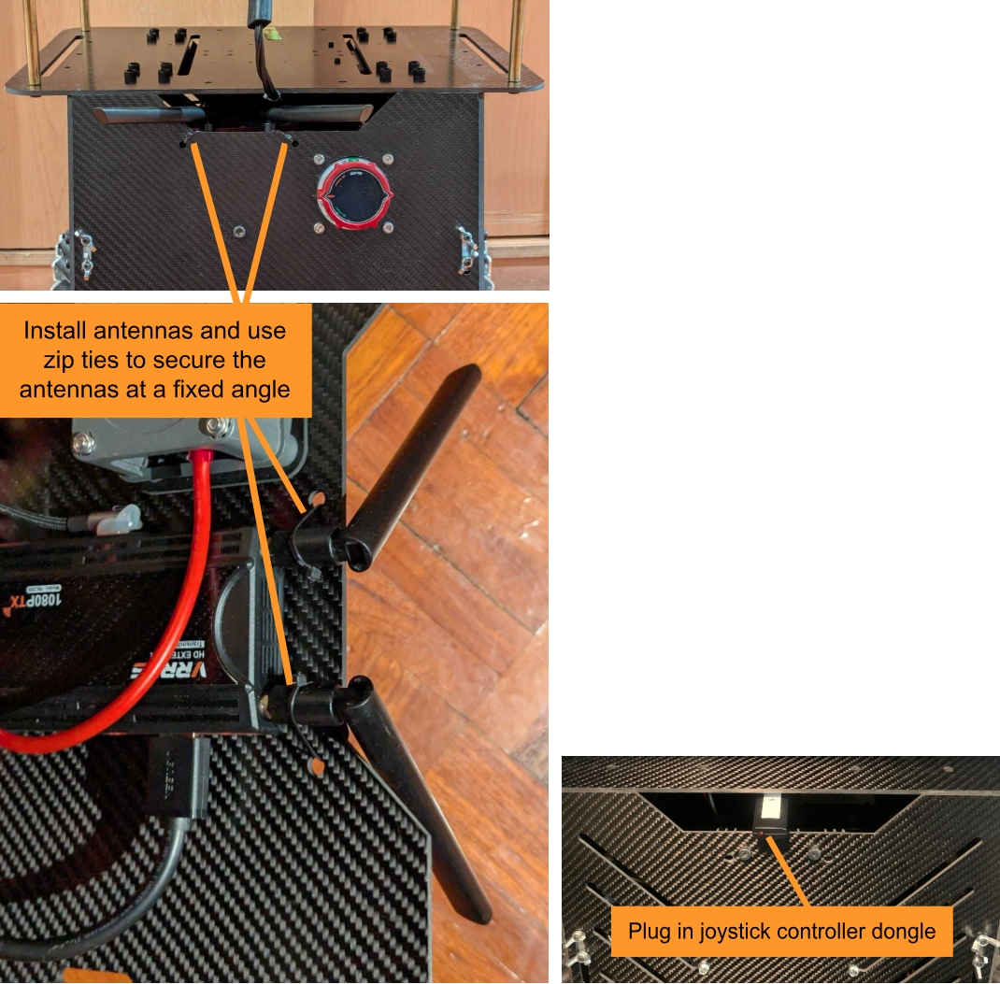
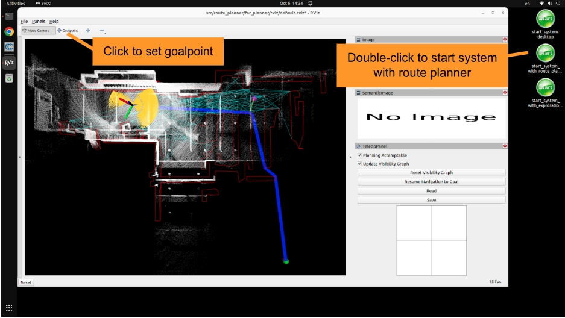

Quick Start Guide
=================

Opening Box
-----------

The box contains the Mecanum wheel vehicle, battery charger, joystick controller, wireless HDMI receiver, TX60 split cable, TX60 to 5.5mmx2.5mm DC cable, USB-A to Ethernet adapter, USB-C to USB-A adapter, Ethernet cable, 2x 5v chargers, 2x USB-C cables, dummy HDMI plug, and 2x bungee cords. **Please make sure to charge the vehicle battery fully.**

.. list-table::
   :widths: 38 62 
   :align: center
   :class: no-border

   * - .. image:: ./images/image42.jpg
         :width: 100%
     - .. image:: ./images/image43.jpg
         :width: 96%

Installing Antennas and Dongle
------------------------------

The antennas of the wireless HDMI sender are removed for shipping. Please open the rear panel of the vehicle and install the antennas. Then, use zip ties to secure the antennas at a fixed angle. Also, plug in the joystick controller dongle to the USB hub on the vehicle. The joystick controller dongle, antennas, and zip ties are included in the box.

|

Setting up Control Station
--------------------------

Please prepare a monitor with HDMI cable and a set of wireless keyboard and mouse. Plug in the wireless keyboard and mouse dongle to the USB hub on the vehicle. Set up a control station by connecting the wireless HDMI receiver to the monitor with the HDMI cable and powering it on with the 5v charger and USB-C cable. Power on the vehicle by turning the switch clockwise all the way to the end and voltage is displayed on the switch. Wait for a minute and the vehicle NUC computer desktop should show up on the monitor.

.. image:: ./images/image37.jpg
    :width: 93%
    :align: center

|

The joystick controller dongle may not be recognized correctly after the vehicle is powered on. **Please unplug and re-plug in the joystick controller dongle once after powering on the vehicle for it to be recognized correctly. Once recognized correctly, the top two and bottom two status LEDs on the joystick controller should be on (press the center button on the joystick controller to turn it on).**

|

Launching System
----------------

From the control station, use the three desktop buttons to launch the system. Double-click the button named 'start_system.desktop' to launch the base autonomy system. Then, use a combination of the 'Waypoint' button and control panel in RVIZ and the joystick controller to operate the system (make sure the joystick controller is powered on). Please follow instructions in the Switching Mode section below to operate the system in *smart joystick mode*, *waypoint mode*, and *manual mode*. To launch the system with route planner, use the button named 'start_system_with_route_planner.desktop' and send a goal point with the 'Goalpoint' button in RVIZ. To launch the system with exploration planner, use the button named 'start_system_with_exploration_planner.desktop' and click the 'Resume Navigation to Goal' button in RVIZ to start the exploration. Please check out the `Operation Instruction Videos <https://tarerobotics.readthedocs.io/en/latest/operation_instruction_videos.html>`_ section.

Launching base autonomy system:

.. image:: ./images/image39.jpg
    :width: 85%
    :align: center

|

Launching system with route planner:

|

Launching system with exploration planner:

.. image:: ./images/image41.jpg
    :width: 85%
    :align: center

|

Operating Modes
---------------

Please check out the `Operation Instruction Videos <https://tarerobotics.readthedocs.io/en/latest/operation_instruction_videos.html>`_ section for video illustration of the operating modes.

- *Smart joystick mode (default)*: The vehicle tries to follow joystick commands and also avoid collisions. Use the control panel in RVIZ or the right joystick on the controller to set the speed and yaw rate. If the system is in another mode, doing so will switch the system to smart joystick mode.

- *Waypoint mode*: The vehicle tries to follow waypoints and also avoid collisions. Use the 'Waypoint' button in RVIZ to set a waypoint by first clicking the button and then clicking where the waypoint is to be set around the vehicle. If the system is in another mode, clicking the 'Resume Navigation to Goal' button in RVIZ switches the system to waypoint mode. Or, users can hold the 'waypoint-mode' button on the controller and use the right joystick to set the speed. If only holding the 'waypoint-mode' button, the system will use the speed sent in ROS messages.

- *Manual mode*: The vehicle tries to follow joystick commands without any collision avoidance. Pressing the 'manual-mode' button on the controller switches the system to manual mode. Then, use the right joystick to set the forward and lateral speed and the left joystick to set the yaw rate, in the Mode 2 convention.

.. list-table::
   :widths: 65 35 
   :align: center
   :class: no-border

   * - .. image:: ./images/image15.jpg
         :width: 100%
     - .. image:: ./images/image21.jpg
         :width: 100%

Notes
-----

- The battery when fully charged is at 29v and when empty is at 24v. When charging the battery, please make sure to stop the system so the vehicle will not drive.

- Please avoid downward staircases. The system does not recognize it and can fall off the stairs.

- If the vehicle gets stuck and cannot move, try pressing the 'clear-terrain-map button' on the joystick controller.

- When powering off the vehicle, we recommend first powering off the vehicle NUC computer from the control station. Then, turn off the switch on the vehicle.

- The joystick controller has multiple modes. If the mode is accidentally changed, please change it back to the default mode (top two and bottom two status LEDs on).

- The username and password of the vehicle NUC computer are both 'all'

