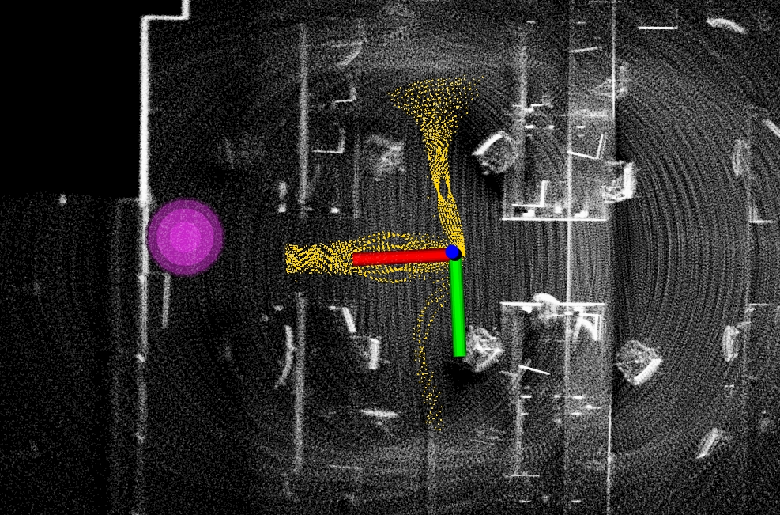

Collision Avoidance
===================

The collision avoidance planner warrants safety in reaching waypoints that are sent by high-level planners. It computes and follows collision-free paths that lead to the waypoint. The collision avoidance planner pre-computes a motion primitive library and associates the motion primitives with 2D locations in the vicinity of the vehicle. The motion primitives are modeled as Monte Carlo samples and organized in groups. In real-time, when a location is occupied by obstacles, the planner can determine motion primitives that collide with the obstacle within milliseconds. The planner then selects the group of motion primitives with the maximum likelihood toward the waypoint. The traversability is determined by the terrain characteristics. The collision avoidance planner takes in the terrain map from the terrain traversability analysis module (see Terrain Traversability Analysis section).

Launch the base autonomy system and use the 'Waypoint' button in RVIZ to set a waypoint in the vicinity of the vehicle. Make sure the waypoint is reachable. Users should see yellow collision-free paths in RVIZ while the vehicle approaches the waypoint. The magenta ball is the waypoint.

|

Alternatively, the collision avoidance planner can take joystick input. This is equivalent to setting a waypoint very far and only the direction to the waypoint is effective. Users can use the joystick controller or the control panel in RVIZ to navigate the vehicle. The vehicle will avoid collisions. If using the joystick controller, operate the right joystick on it. To resume navigation to the waypoint, click the 'Resume Navigation to Goal' button in RVIZ. Or, users can hold the 'waypoint-mode' button on the joystick controller and use the right joystick to set the speed. Please check out the `Operation Instruction Videos <https://tarerobotics.readthedocs.io/en/latest/operation_instruction_videos.html>`_ section.

The speed is set in the `'src/base_autonomy/local_planner/launch/local_planner.launch' <https://github.com/jizhang-cmu/autonomy_stack_mecanum_wheel_platform/blob/jazzy/src/base_autonomy/local_planner/launch/local_planner.launch>`_ file. The ``maxSpeed`` defines the maximum speed in all modes and ``autonomySpeed`` defines the speed in *waypoint mode*. When navigating in tight areas, reduce both speeds to 0.75 or 0.5 (m/s).

In indoor environments, to avoid low obstacles, users can reduce ``obstacleHeightThre`` in the `'src/base_autonomy/local_planner/launch/local_planner.launch' <https://github.com/jizhang-cmu/autonomy_stack_mecanum_wheel_platform/blob/jazzy/src/base_autonomy/local_planner/launch/local_planner.launch>`_ file from 0.05 to as small as 0.015 or 0.02. The vehicle will avoid obstacles at 2-2.5cm above ground. Please set the threshold higher (0.1-0.15) in outdoor environments.

To write custom code to send waypoints to the system, please refer to the example code in the `'src/base_autonomy/waypoint_example' <https://github.com/jizhang-cmu/autonomy_stack_mecanum_wheel_platform/tree/jazzy/src/base_autonomy/waypoint_example>`_ package. **Note that the vehicle will only navigate to the waypoint when in *waypoint mode*. Click the 'Resume Navigation to Goal' button in RVIZ to switch to *waypoint mode*.**
