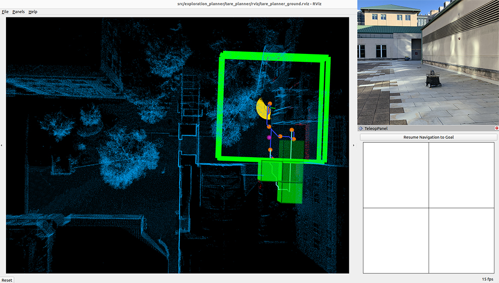

Exploration Planning
====================

The exploration planner is a hierarchical framework that utilizes a two-layered representation of the environment to plan the exploration path in a multi-resolution manner. The planner uses low-resolution information to plan a coarse path at the global level. In the local area surrounding the vehicle, the planner plans a detailed path using high-resolution information. The method optimizes the overall path by solving a traveling salesman problem at each level. Compared to existing methods relying on greedy strategies, the planner can effectively adapt to the structural environment and produce an approximately optimal exploration path that avoids redundant revisiting.

Launch the system with exploration planner and click the 'Resume Navigation to Goal' button in RVIZ to start the exploration. Users can adjust the navigation boundary to constrain the areas to explore by updating the boundary polygon in the `'src/exploration_planner/tare_planner/data/boundary.ply' <https://github.com/jizhang-cmu/autonomy_stack_mecanum_wheel_platform/blob/jazzy/src/exploration_planner/tare_planner/data/boundary.ply>`_ file. Also, set ``use_boundary = true`` in the `'src/exploration_planner/tare_planner/launch/explore_world.launch' <https://github.com/jizhang-cmu/autonomy_stack_mecanum_wheel_platform/blob/jazzy/src/exploration_planner/tare_planner/launch/explore_world.launch>`_ file to tune on exploration boundary.

|

When navigating with the exploration planner, the base autonomy system operates in *waypoint mode*. Users can click in the black box on the control panel to switch to smart *joystick mode*, or press the buttons on a joystick controller to switch to *smart joystick mode* or *manual mode*. To resume exploration, click the 'Resume Navigation to Goal' button in RVIZ. Or, users can hold the 'waypoint-mode' button on the joystick controller and use the right joystick to set the speed. Please check out the `Operation Instruction Videos <https://tarerobotics.readthedocs.io/en/latest/operation_instruction_videos.html>`_ section.

The exploration planner is provided with multiple configurations. To change the configuration of the exploration planner, go to the `'src/base_autonomy/vehicle_simulator/launch' <https://github.com/jizhang-cmu/autonomy_stack_mecanum_wheel_platform/tree/jazzy/src/base_autonomy/vehicle_simulator/launch>`_ folder and find ``exploration_planner_config`` in the 'system_unity_with_exploration_planner.launch', 'system_real_robot_with_exploration_planner.launch', and 'system_bagfile_with_exploration_planner.launch' files, change it from 'indoor_small' to 'indoor_large' or 'outdoor'. Users can configure the settings for simulation, real-robot deployment, and bagfile processing differently in the launch files. To tune the exploration planner configuration, refer to the `Exploration Planner Tuning <https://tarerobotics.readthedocs.io/en/latest/other_useful_information/exploration_planner_tuning.html>`_ section.

