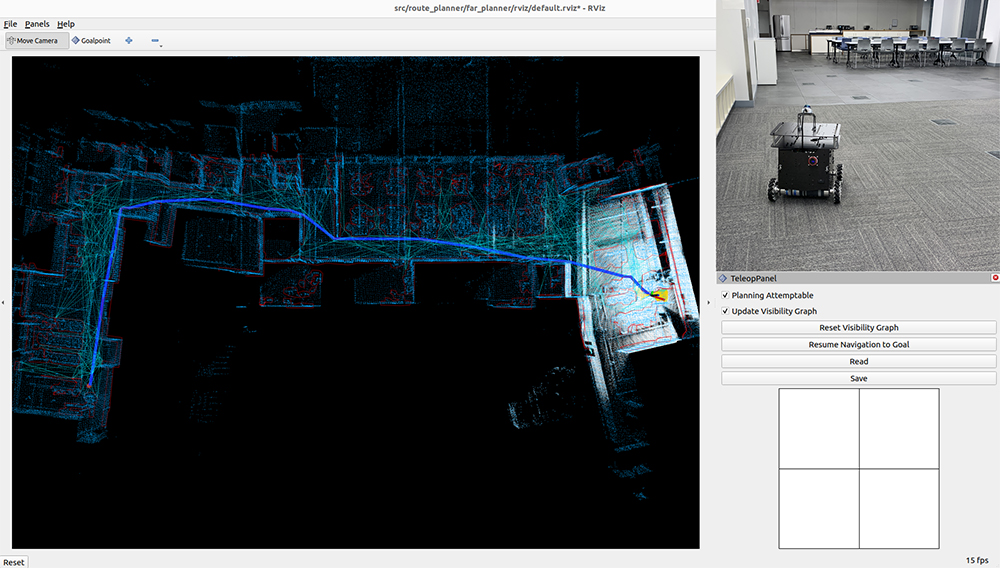

Route Planning
==============

The route planner is a visibility graph-based planner that dynamically builds and maintains a reduced visibility graph along with the navigation. The planner can handle both known and unknown environments. In a known environment, it uses a prior map to plan the route. In an unknown environment, however, it attempts multiple ways to guide the vehicle to the goal and picks up the environment layout during the navigation. The planner models obstacles in the environment as polygons. It extracts edge points around the obstacles and converts the edge points into a set of polygons. The polygons are then merged over sensor data frames, and from which the visibility graph is developed.

Launch the system with route planner and use the 'Goalpoint' button in RVIZ to set a goal point. The vehicle will navigate to the goal and build a visibility graph (in cyan) along the way. Areas covered by the visibility graph become free space. When navigating in free space, the planner uses the built visibility graph, and when navigating in unknown space, the planner attempts to discover a way to the goal. By pressing the 'Reset Visibility Graph' button, the planner will reinitialize the visibility graph. By unchecking the 'Planning Attemptable' checkbox, the planner will first try to find a path through the free space. The path will show in green. If such a path does not exist, the planner will consider unknown space together. The path will show in blue (shown in the figure). By unchecking the 'Update Visibility Graph' checkbox, the planner will stop updating the visibility graph. Use the 'Save' buttons to save the visibility graph to file and the 'Read' button to load it. **Note that if loading a visibility graph created from a previous run, the world frame needs to align with the previous run. Users can launch the system in SLAM localization mode to make sure the world frame is aligned between the two runs.**

When navigating with the route planner, the base autonomy system operates in *waypoint mode*. Users can click in the black box on the control panel to switch to *smart joystick mode*, or press the buttons on a joystick controller to switch to *smart joystick mode* or *manual mode*. To resume route planner navigation, click the 'Resume Navigation to Goal' button in RVIZ or use the 'Goalpoint' button to set a new goal point. Or, users can hold the 'waypoint-mode' button on the joystick controller and use the right joystick to set the speed.

To tune the route planner configuration, refer to the `Route Planner Tuning <https://tarerobotics.readthedocs.io/en/latest/other_useful_information/route_planner_tuning.html>`_ section.
