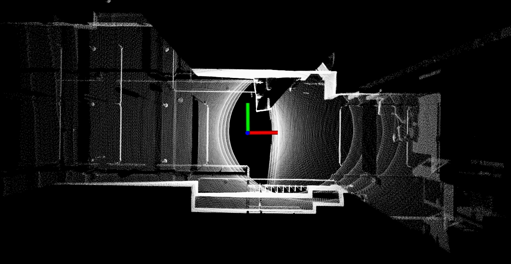
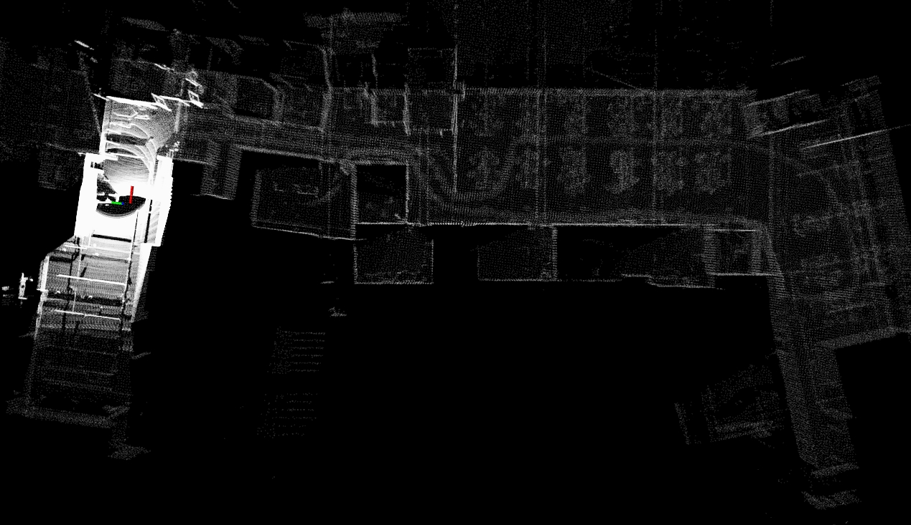
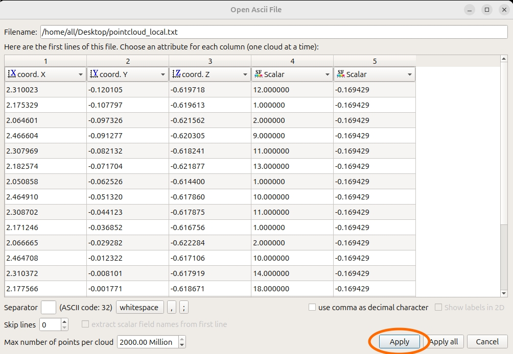
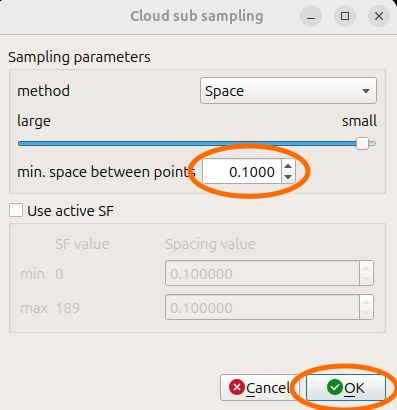
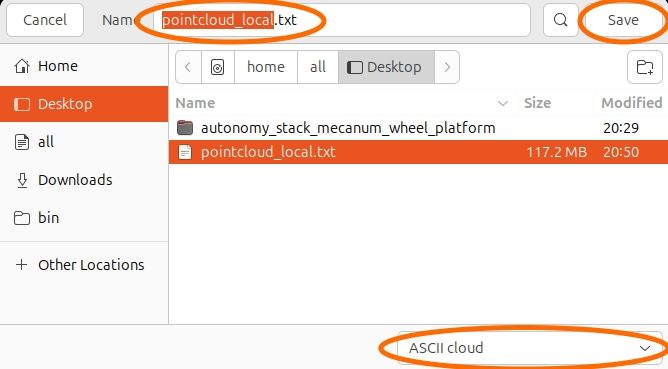
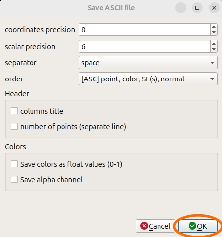
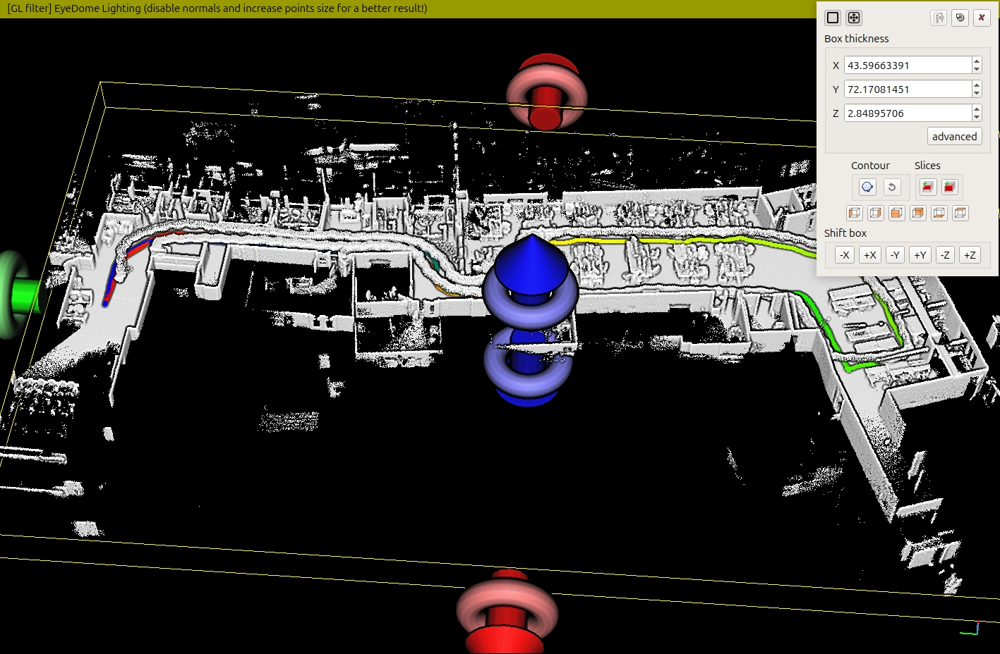

SLAM
====

The SLAM module conducts scan matching to incrementally build a map of the traversed environment and at the same time estimates the vehicle pose on the map. The SLAM module extracts and matches planner and edge points. Measurements from IMU are pre-integrated to the front of the scan matching pose and used for motion undistortion of the raw lidar scans. The SLAM module can operate in mapping mode to build a map from scratch and in localization mode to load a prior map and localize on the map.

Mapping Mode
------------

Launch the base autonomy system and users should see vehicle pose and registered scans in RVIZ. The vehicle pose is published as `ROS Odometry <https://docs.ros2.org/foxy/api/nav_msgs/msg/Odometry.html>`_ typed messages on the '/state_estimation' topic (coordinate frame in the figure) and the registered scans are published as `ROS PointCloud2 <https://docs.ros2.org/foxy/api/sensor_msgs/msg/PointCloud2.html>`_ typed messages on the '/registered_scan' topic (white points in the figure). When the vehicle navigates, users should see the vehicle pose moving in RVIZ and the registered scans covering newly traversed areas. The registered scans are further converted to the vehicle frame and published on the '/sensor_scan' topic. The corresponding vehicle pose is published on the '/state_estimation_at_scan' topic, where each pose message corresponds to a scan message with the same timestamp.

|

To save a point cloud file during a run, set ``savePcd = true`` in 
the `'src/base_autonomy/visualization_tools/launch/visualization_tools.launch' <https://github.com/jizhang-cmu/autonomy_stack_mecanum_wheel_platform/blob/jazzy/src/base_autonomy/visualization_tools/launch/visualization_tools.launch>`_ file. A 'pointcloud_xxx.txt' file is saved in the `'src/base_autonomy/vehicle_simulator/log' <https://github.com/jizhang-cmu/autonomy_stack_mecanum_wheel_platform/tree/jazzy/src/base_autonomy/vehicle_simulator/log>`_ folder, where 'xxx' is the timestamp. To save a trajectory file, set ``saveTraj = true`` and a 'trajectory_xxx.txt' file is saved. The format is described in the 'readme.txt' file in the same folder.

Localization Mode
-----------------

Once a point cloud file is saved, users can start the SLAM module in localization mode. Copy the point cloud file to the desktop and rename it 'pointcloud_local.txt'. Then, in the `'src/slam/arise_slam_mid360/config/livox_mid360.yaml' <https://github.com/jizhang-cmu/autonomy_stack_mecanum_wheel_platform/blob/jazzy/src/slam/arise_slam_mid360/config/livox_mid360.yaml>`_ file, set ``local_mode = true`` and adjust ``init_x``, ``init_y``, ``init_z``, and ``init_yaw`` for the starting pose. We recommend keeping the values zero as default and marking the vehicle starting pose on the ground during the mapping run. Then, start the localization run from the same pose. Upon start of the localization run, the prior map should be displayed in RVIZ as the gray points. The white points on the left are registered scans localized on the prior map. Now you can navigate the vehicle around.

|

If the point cloud file is large, the system will take several seconds to a minute to load the prior map. Users can manually downsample the point cloud file to save the system startup time. We recommend using `CloudCompare <https://www.danielgm.net/cc/>`_ (installed on the vehicle NUC computer). Start the software and open the 'pointcloud_local.txt' file. Load all five columns by default and click 'Apply'.

|

Then, click the point cloud to select it in the 'DB Tree' window and click the 'Subsample a point cloud' icon in the toolbar. For indoor environments, we recommend downsampling the point cloud to 0.1m resolution. For outdoor environments, use 0.2m. Click 'Ok' to downsample.

|

Select the newly created downsampled point cloud in the 'DB Tree' window and save it to file. Make sure to select 'ASCII' cloud at the lower right corner, set the file name, and 'Save'.

|

Then, in the next window, keep the default setting and click 'Ok' to save the file. Now, you can use the downsampled point cloud as the prior map.

|

Viewing Map
------------

To check out the save point cloud and trajectory files, also use `CloudCompare <https://www.danielgm.net/cc/>`_. Click the 'EDL' icon to add artificial shading. Point clouds from indoor environments often contain ceilings. To reveal the inside of the point cloud, click the point cloud to select it in the 'DB Tree' window and click the 'Cross Section' icon. Use mouse to pull the boundaries of the cross section and remove the ceiling. Now, you can check out the inside of the point cloud and the trajectory.

|

