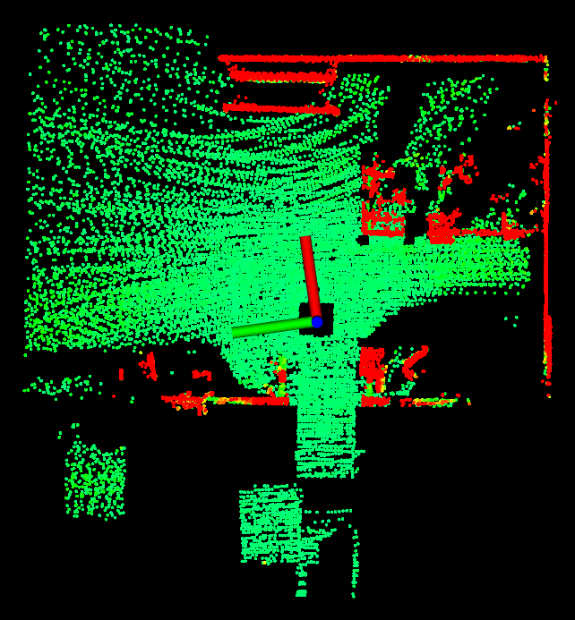
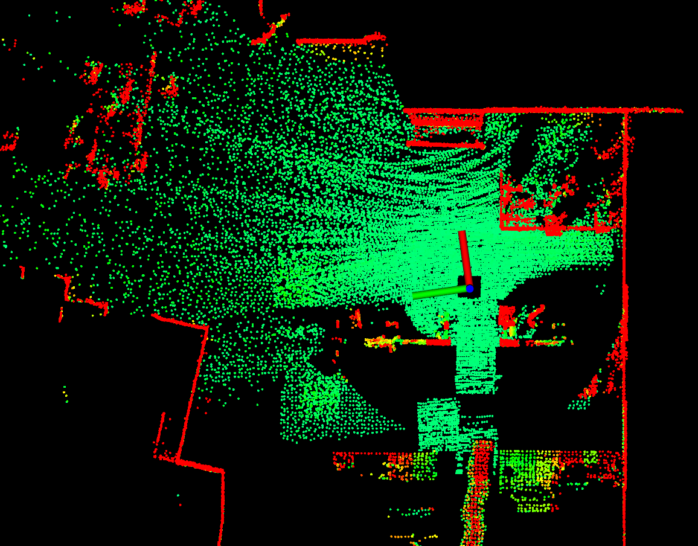

Terrain Traversability Analysis
===============================

The terrain traversability analysis module examines the traversability of the local terrain surrounding the vehicle. The module builds a cost map where each point on the map is associated with a traversal cost. The cost is determined by the local smoothness of the terrain. We use a voxel grid to represent the environment and analyze the distributions of data points in adjacent voxels to estimate the ground height. The points are associated with higher traversal costs if they are further apart from the ground.

Launch the base autonomy system. In RVIZ, click 'Pannels->Displays' and toggle 'TerrainMap' and 'TerrainMapExt', users should see two terrain maps in RVIZ. The first is in a 10m area around the vehicle (left in the figure) and the second is in a 40m area (right in the figure). The green points are traversable and the red points are obstacles. The two terrain maps are published as ROS PointCloud2 typed messages on the '/terrain_map' and '/terrain_map_ext' topics. The traversal cost is stored in the intensity field.

|pic1| |pic2|

